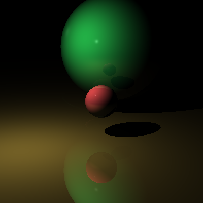
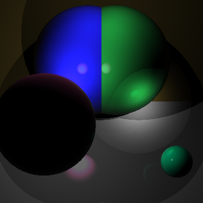

# Project 3 - Illumination

A raycaster written in C with a simple illumination model.

This project is an extension of a [previous raycaster](https://github.com/petetetete/cs430-project2) with added attenuation and reflection calculations. This program still uses a CSV scene description file and simple command line parameters.

## Usage

Get a local copy of the repository by downloading the zip or using `git clone`. This includes a makefile which allows you to simply `make` the project as long as you are in a *UNIX-like* environment.

Then, depending on your operating system/environment, you can run the program by using one of the following command formats:

```
./raycast.exe 100 100 objects.csv output.ppm
```
```
raycast 100 100 objects.csv output.ppm
```

The first two numbers represent width and height (respectively). `objects.csv` is the path to a CSV file in which each line represents an object (camera, sphere, plane, light) and its respective properties. Finally, `output.ppm` is the name of the PPM file to be created.

## Examples

### Simple Ball & Plane Example


[Ball & Plane CSV](examples/ball_plane.csv) - (width: 400px, height: 400px)

The above example features **a sphere**, **a plane**, and **a point light** and accurately calculates the illumination of said scene.

### Fringe-Case Example


[Fringe-Case CSV](examples/fringe.csv) - (width: 400px, height: 400px)

The above example features **4 spheres**, **2 planes**, **2 point lights**, and **1 spot light**. Two of the spheres and the two planes are intersecting, and one of the spheres is far closer to the camera than the others. This example demonstrates how the illumination model responds to strange scenes.

## Known Issues/Strange Behavior
* None (so far)

## Author
Peter Huettl - [ph289@nau.edu](mailto:ph289@nau.edu)
